

<a href="https://github.com/kuryrc">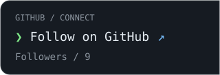</a><a href="https://t.me/kuryrc_channel">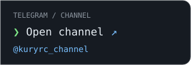</a>

 

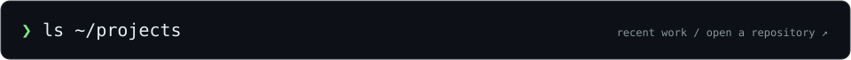

<!-- PROJECTS:START -->

<a href="https://github.com/kuryrc/omarchy-lyricify">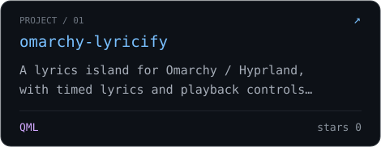</a> <a href="https://github.com/kuryrc/omarchy-mfa">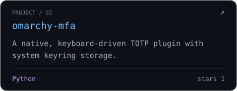</a>

<a href="https://github.com/kuryrc/raycast-plugins">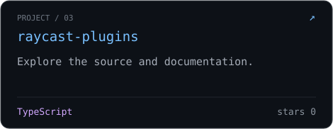</a> <a href="https://github.com/kuryrc/pfwd">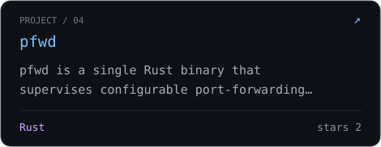</a>

<a href="https://github.com/kuryrc/fs-bench-rs">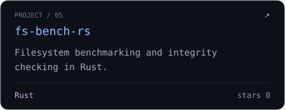</a> <a href="https://github.com/kuryrc?tab=repositories">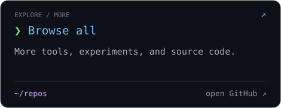</a>

<!-- PROJECTS:END -->

[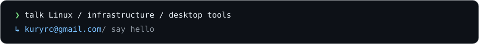](mailto:kuryrc@gmail.com)
